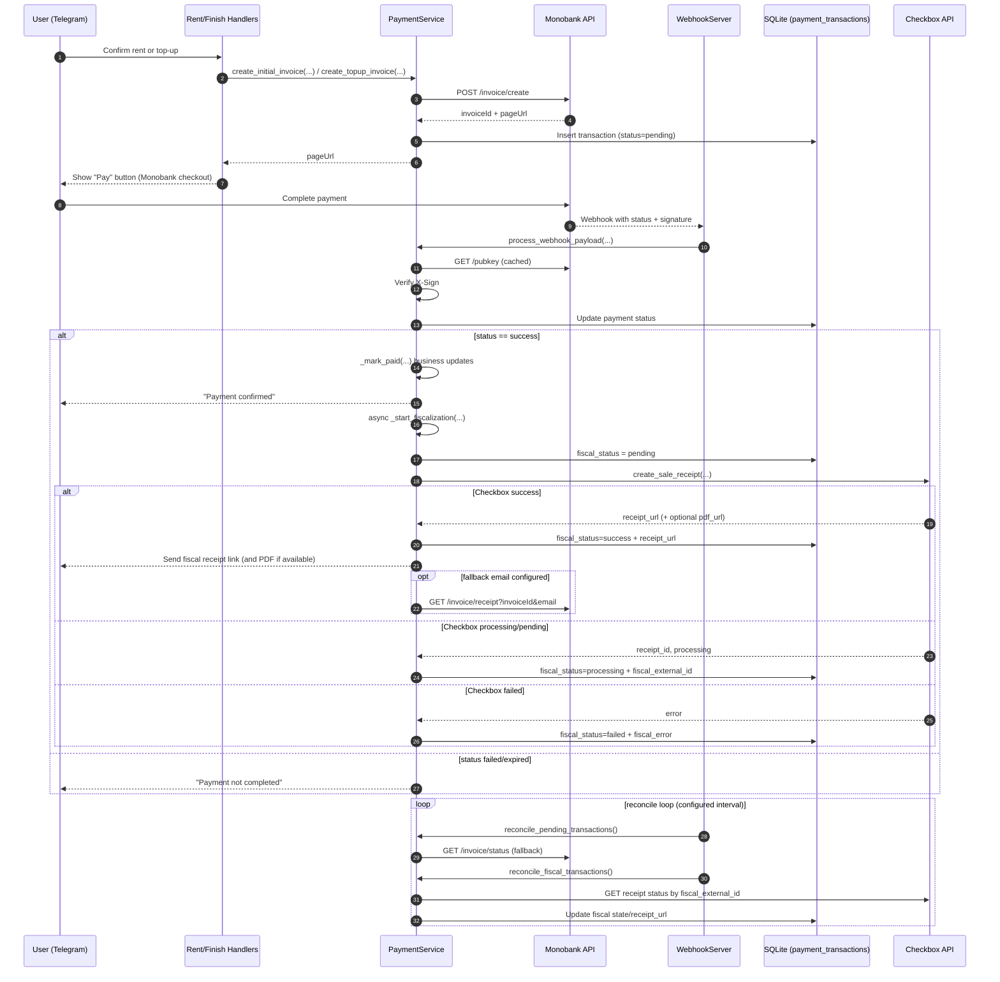

# Payment Flow Description: Monobank API + Checkbox API

## 1. Загальна роль кожного сервісу

- Monobank API у проєкті виконує роль платіжного шлюзу: створення інвойсу, редірект користувача на оплату, отримання фінального статусу платежу через webhook та fallback-перевірки status API.
- Checkbox API у проєкті виконує роль PRRO/фіскалізації: після успішної оплати в Monobank створюється фіскальний чек, його статус доганяється у background-reconcile, а посилання на чек відправляється користувачу та зберігається в БД.

## 1.1 Diagram (Current Runtime Flow)



---

## 1.2 Checkbox Shift Lifecycle (Daily Cycle)

Shift maintenance window in config.py:
# --- Shift schedule ---
SHIFT_CLOSE_START = dtime(18, 12)
SHIFT_CLOSE_END = dtime(18, 20)


```
23:45 (SHIFT_CLOSE_START)
  │
  ├── enforce_checkbox_shift_policy() fires (runs every fiscal_retry_interval_sec)
  │     └── close_shift() → POST /api/v1/shifts/close
  │           • if already closed → treated as success (idempotent)
  │           • _last_shift_close_date = today → won't fire again until tomorrow
  │
  ├── SHIFT_CLOSE_START → SHIFT_CLOSE_END  (maintenance window, is_shift_closed() == True)
  │     • new initial invoices: BLOCKED (user shown MSG_SHIFT_CLOSED)
  │     • topup invoices: ALLOWED (payment proceeds normally)
  │     • _start_fiscalization(): DEFERRED
  │           └── fiscal_status = "processing"
  │               fiscal_error  = "Deferred: maintenance window active"
  │               User gets MSG_FISCAL_DEFERRED once (idempotent, checked via fiscal_error prefix)
  │
00:00 (SHIFT_CLOSE_END) — maintenance window ends
  │
  ├── reconcile_fiscal_transactions() picks up deferred transactions
  │     └── _start_fiscalization() re-runs (is_shift_closed() == False now)
  │           ├── POST /api/v1/receipts/sell
  │           │     ├── success → fiscal_status="success", user receives receipt link
  │           │     └── shift.not_opened error (shift not yet re-opened)
  │           │           └── auto-heal: open_shift() → POST /api/v1/shifts
  │           │                 └── retry POST /api/v1/receipts/sell
  │           │                       ├── success → receipt delivered
  │           │                       └── failed → fiscal_status="processing" (retry next cycle)
  │           └── retryable error → fiscal_status="processing", retried next reconcile cycle
  │
  └── Next day at SHIFT_CLOSE_START — cycle repeats
```

---

## 2. Де у флоу оренди викликається Monobank

### 2.1 Початкова оплата оренди

1. Користувач проходить вибір станції/комірок/тривалості в `handlers/rent.py`.
2. У `choose_rent_time(...)` формується `destination` і викликається:
   - `payment_service.create_initial_invoice(...)`
3. `PaymentService.create_initial_invoice(...)`:
   - валідує відповідність station/locker
   - готує payload для `POST /api/merchant/invoice/create`
   - додає `webHookUrl` лише якщо він публічний і https
   - отримує від Monobank `invoiceId` + `pageUrl`
   - створює запис у `payment_transactions` зі статусом `pending`
4. Користувачу в Telegram показується кнопка переходу на оплату (`pageUrl`).

### 2.2 Доплата при завершенні оренди

1. У `handlers/finishRent.py` при овертаймі обчислюється `fin_pay`.
2. Викликається:
   - `payment_service.create_topup_invoice(...)`
3. Логіка аналогічна initial invoice, але тип транзакції `topup`.

---

## 3. Як Monobank повідомляє про результат оплати

### 3.1 Webhook (основний канал)

- Сервер webhook піднімається в `services/payments/webhook_server.py`.
- Endpoint: `MONO_WEBHOOK_PATH` (типово `/webhooks/monobank`).
- Для кожного webhook:
  1. перевіряється `X-Sign` (ECDSA)
  2. payload передається в `PaymentService.process_webhook_payload(...)`

### 3.2 Що робить process_webhook_payload

1. Нормалізує статус Monobank (`created/processing/success/failure/...`) у внутрішній статус.
2. Робить idempotency-гард (повторні terminal webhook не перетирають фінальний стан).
3. Оновлює `payment_transactions.status`.
4. На `success` викликає `_mark_paid(...)`:
   - для initial: переводить оренди в `Очікування відкриття`, оновлює стани комірок, надсилає користувачу підтвердження
   - для topup: закриває доплату/оренду, надсилає підтвердження

### 3.3 Fallback reconcile (коли webhook пропущено)

- У `MonobankWebhookServer._reconcile_loop(...)` запускається цикл.
- Викликається `reconcile_pending_transactions()`:
  - бере `pending/processing` транзакції
  - опитує `GET /api/merchant/invoice/status`
  - проганяє результат через той самий `process_webhook_payload(...)`

---

## 4. Де у флоу підключається Checkbox

### 4.1 Точка запуску фіскалізації

- Після успішної оплати в `_mark_paid(...)` запускається background task:
  - `asyncio.create_task(self._start_fiscalization(tx, invoice_id))`
- Тобто доступ до оренди не блокується очікуванням фіскального чека.

### 4.2 Що робить _start_fiscalization

1. Перевіряє, чи Checkbox увімкнений (`CHECKBOX_ENABLED`) і чи є токен.
2. Ставить fiscal-статус транзакції в `pending`.
3. Формує агрегований payload (`_build_checkbox_sale_payload(...)`) з 1 товарною позицією:
   - `SUP_RENTAL` або `SUP_TOPUP`
   - сума = весь платіж
   - назва містить локацію станції
4. Викликає `CheckboxClient.create_sale_receipt(...)`.
5. За результатом:
   - `success`: зберігає `receipt_url` у `payment_transactions.receipt_url`, надсилає клієнту чек
   - `failed`: фіксує fiscal failure
   - `processing/pending`: фіксує проміжний стан для подальшого reconcile

### 4.3 Reconcile для Checkbox

- У тому ж циклі `_reconcile_loop(...)` викликається `reconcile_fiscal_transactions()`:
  - бере `success`-платежі з fiscal_status `not_started/pending/processing`
  - якщо немає `fiscal_external_id` — пробує старт фіскалізації ще раз
  - якщо `fiscal_external_id` є — опитує `CheckboxClient.get_receipt_status(...)`
  - при timeout вікна (`FISCAL_RETRY_WINDOW_MIN`) ставить `failed`

---

## 5. Як зараз зберігається чек і куди відправляється

### 5.1 Збереження в БД

`payment_transactions.receipt_url` використовується як головне поле посилання на чек.

- На Monobank success воно може короткочасно містити monobank receipt URL (якщо повернувся у payload/status).
- Після успішної Checkbox-фіскалізації поле оновлюється фіскальним посиланням (`update_payment_transaction_fiscal(..., receipt_url=...)`).

Додатково ведуться поля lifecycle:
- `fiscal_status`
- `fiscal_external_id`
- `fiscal_provider`
- `fiscal_error`
- `fiscal_updated_at`

### 5.2 Доставка клієнту

Після fiscal success у `_notify_fiscal_receipt(...)`:
- Telegram message з посиланням на чек
- Telegram document з PDF, якщо API повернув `pdf_url`
- опційно виклик Monobank `invoice/receipt` для email, якщо задано `MONO_RECEIPT_EMAIL_FALLBACK`

---

## 6. Які функції у флоу оренди виконує кожен API (коротко)

### Monobank API

- створює платіжні інвойси для initial/topup
- приймає оплату на hosted checkout page
- повертає фінальний статус оплати
- дає криптографічно верифікований webhook
- дає fallback status API для reconcile

### Checkbox API

- створює фіскальний чек (PRRO) після `payment success`
- повертає/формує публічне посилання на чек
- дає API перевірки статусу чека для retry/reconcile
- забезпечує джерело `receipt_url`, яке зберігається у `payment_transactions`

---

## 7. Поточна взаємодія Monobank + Checkbox у проєкті (висновок)

Ланцюжок зараз такий:

1. `Rent/Topup -> Monobank invoice create`
2. `User pays on Monobank page`
3. `Webhook/status success -> rental business state updated`
4. `Async start Checkbox fiscalization`
5. `Checkbox success -> save receipt_url + notify user`
6. `Background reconcile closes pending fiscal cases`

---

## 8. Checkbox Shift — Детальний опис

### 8.1 Що таке "зміна" (shift) у Checkbox

Checkbox PRRO вимагає, щоб перед видачею фіскального чека касовий апарат знаходився у стані відкритої зміни. Зміна — це робочий сеанс касира. Без відкритої зміни будь-який виклик `POST /api/v1/receipts/sell` завершується помилкою `shift.not_opened`. Відповідно, бот повинен керувати lifecycle зміни: відкривати її на початку дня і закривати наприкінці.

### 8.2 Конфігурація

| Константа / env | Де задається | Що контролює |
|---|---|---|
| `SHIFT_CLOSE_START` | `config_data/config.py` | Час початку технічного вікна та автоматичного закриття зміни Checkbox |
| `SHIFT_CLOSE_END` | `config_data/config.py` | Час закінчення технічного вікна (після цього reconcile відновлює фіскалізацію) |
| `CHECKBOX_SHIFT_TIMEZONE` | `.env` | Часовий пояс для порівняння часу (за замовчуванням `Europe/Kyiv`) |
| `CHECKBOX_SHIFT_AUTO_CLOSE_TIME` | `.env` | Використовується в `_default_auto_close_at_iso()` при формуванні `go_offline` payload, не впливає на логіку закриття зміни в `enforce_checkbox_shift_policy` |
| `CHECKBOX_LICENSE_KEY` | `.env` | Обов'язковий для `open_shift` і `close_shift`. Без нього операції зі зміною скіпаються з warning |
| `FISCAL_RETRY_INTERVAL_SEC` | `.env` | Інтервал reconcile loop (мін. 10 с) |

### 8.3 Автоматичне закриття зміни (`enforce_checkbox_shift_policy`)

**Де викликається:**
- `MonobankWebhookServer._reconcile_loop()` — кожен цикл, одразу перед reconcile-функціями
- Запускається разом із `webhook_server.start()` у `bot.py`

**Логіка:**
```python
if now_hhmm >= SHIFT_CLOSE_START and _last_shift_close_date != today:
    close_shift()
    _last_shift_close_date = today
```

- Перевіряє поточний час у `CHECKBOX_SHIFT_TIMEZONE`.
- `_last_shift_close_date` — in-memory поле на `PaymentService` інстансі. Не персистується. Після рестарту бота зміна може бути закрита вдруге у той самий день — `close_shift()` це обробляє ідемпотентно (помилка `shift.not_opened` від API трактується як успіх).
- `close_shift()` надсилає `POST /api/v1/shifts/close` з `include_license_key=True`. Payload формується з `CHECKBOX_CLOSE_SHIFT_PAYLOAD` (допустимі поля: `skip_client_name_check`, `report`, `fiscal_code`, `fiscal_date`).

### 8.4 Технічне вікно (`is_shift_closed`)

Функція `is_shift_closed()` (`helper/helper.py`) повертає `True`, коли поточний час Kyiv знаходиться між `SHIFT_CLOSE_START` і `SHIFT_CLOSE_END`.

Підтримуються три конфігурації:
- `start == end` → вікно ніколи не активне (відключено)
- `end > start` → денне вікно, наприклад `02:00–06:00`
- `end < start` → нічне/overnight вікно, наприклад `23:45–00:00` або `23:45–01:00`

**Що блокується під час вікна:**
- Створення нових початкових інвойсів (`create_initial_invoice`) — користувач отримує `MSG_SHIFT_CLOSED` з вказаними часами початку і кінця вікна.
- Фіскалізація в `_start_fiscalization` — транзакція переводиться в `processing` і повідомлення `MSG_FISCAL_DEFERRED` відправляється **один раз** (повторне надсилання не відбувається, якщо `fiscal_error` вже починається з `"Deferred:"`).

**Що дозволяється:**
- Доплати (`create_topup_invoice`) — оплата дозволена, фіскалізація відкладається.

### 8.5 Відкриття зміни (`open_shift`)

Зміна **не відкривається автоматично** за розкладом. Вона відкривається реактивно у двох місцях:

1. **Auto-heal у `CheckboxClient.create_sale_receipt()`**: якщо перший запит на чек повернув `shift.not_opened`, бот автоматично викликає `open_shift()` і повторює запит один раз у рамках того самого HTTP-з'єднання.

2. **Через reconcile**: коли після закінчення вікна (`is_shift_closed() == False`) `reconcile_fiscal_transactions` повторно викликає `_start_fiscalization`, яка викликає `create_sale_receipt`, де спрацьовує той самий auto-heal.

`open_shift()` надсилає `POST /api/v1/shifts` з `include_license_key=True`. Payload містить лише `{"id": "<uuid>"}`.

### 8.6 Фіскалізація під час технічного вікна — повний сценарій

```
Користувач оплачує доплату під час технічного вікна (23:45–00:00):

1. process_webhook_payload → success → _mark_paid → _start_fiscalization
2. is_shift_closed() == True
   → fiscal_status = "processing"
   → fiscal_error  = "Deferred: maintenance window active"
   → Користувач: "🧾 Оплата пройшла успішно. Чек буде надіслано після 00:00."

3. 00:00 — вікно закінчується

4. reconcile_fiscal_transactions (кожні 180 с):
   → знаходить транзакцію зі статусом processing, без fiscal_external_id
   → _start_fiscalization()
   → is_shift_closed() == False
   → create_sale_receipt()

5a. Якщо Checkbox зміна ще не відкрита:
    → shift.not_opened error
    → auto-heal: open_shift()
    → retry create_sale_receipt()
    → success → receipt_url збережено → користувач отримує чек

5b. Якщо зміна вже відкрита (або відкрита за 5a):
    → success → receipt_url збережено → користувач отримує чек

5c. Якщо і retry не вдався:
    → fiscal_status = "processing" (retryable) або "failed" (terminal)
    → наступний цикл reconcile повторить спробу до закінчення FISCAL_RETRY_WINDOW_MIN
```

### 8.7 Retry і вікно повтору

- `_is_retryable_fiscal_error()` визначає, чи помилка є тимчасовою: перевіряє `error_code == "shift.not_opened"` або відповідні рядки в `error_text` та `error_code` (включаючи `"зміну не відкрито"`).
- `_is_fiscal_retry_expired()` перевіряє, чи не перевищено `FISCAL_RETRY_WINDOW_MIN` хвилин з моменту створення транзакції (`paid_at` або `created_at`). Після закінчення вікна транзакція переводиться в `fiscal_status = "failed"`.
- Reconcile не перенадсилає `MSG_FISCAL_DEFERRED` — повідомлення надсилається лише один раз при першому відкладанні.

### 8.8 Таблиця статусів фіскалізації

| `fiscal_status` | Значення |
|---|---|
| `not_started` | Платіж ще не оброблений фіскально (початковий стан) |
| `pending` | Запит на чек надіслано, очікується відповідь API |
| `processing` | Чек у процесі реєстрації (отримано `receipt_id`, але статус ще не `success`), або фіскалізація відкладена через вікно обслуговування |
| `success` | Чек успішно зареєстровано, `receipt_url` збережено |
| `failed` | Фіскалізація завершена з помилкою (нефатальна помилка вичерпала вікно повтору, або критична помилка) |

### 8.9 `go_offline` — коли і для чого

`go_offline()` надсилає касовий апарат в офлайн-режим. У поточній кодовій базі цей метод визначений у `CheckboxClient`, але **ніде не викликається автоматично** — він доступний для ручного або майбутнього використання. Його не слід плутати з `close_shift()`: закриття зміни — фінансова операція, яка підсумовує денні чеки; перехід в офлайн — технічний режим касового апарата.
