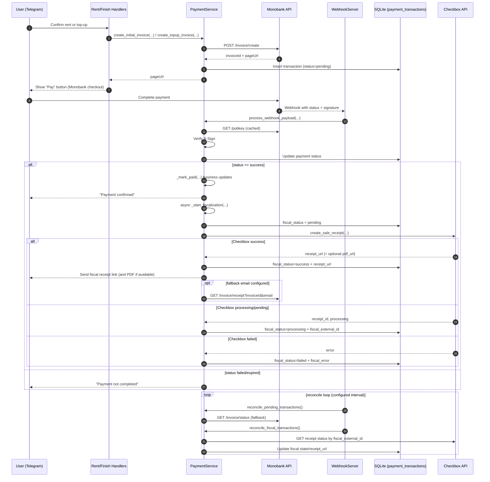

# Payment Flow Description: Monobank API + Checkbox API

## 1. Загальна роль кожного сервісу

- Monobank API у проєкті виконує роль платіжного шлюзу: створення інвойсу, редірект користувача на оплату, отримання фінального статусу платежу через webhook та fallback-перевірки status API.
- Checkbox API у проєкті виконує роль PRRO/фіскалізації: після успішної оплати в Monobank створюється фіскальний чек, його статус доганяється у background-reconcile, а посилання на чек відправляється користувачу та зберігається в БД.

## 1.1 Diagram (Current Runtime Flow)

---

## 2. Де у флоу оренди викликається Monobank

### 2.1 Початкова оплата оренди

1. Користувач проходить вибір станції/комірок/тривалості в `handlers/rent.py`.
2. У `choose_rent_time(...)` формується `destination` і викликається:
   - `payment_service.create_initial_invoice(...)`
3. `PaymentService.create_initial_invoice(...)`:
   - валідує відповідність station/locker
   - готує payload для `POST /api/merchant/invoice/create`
   - додає `webHookUrl` лише якщо він публічний і https
   - отримує від Monobank `invoiceId` + `pageUrl`
   - створює запис у `payment_transactions` зі статусом `pending`
4. Користувачу в Telegram показується кнопка переходу на оплату (`pageUrl`).

### 2.2 Доплата при завершенні оренди

1. У `handlers/finishRent.py` при овертаймі обчислюється `fin_pay`.
2. Викликається:
   - `payment_service.create_topup_invoice(...)`
3. Логіка аналогічна initial invoice, але тип транзакції `topup`.

---

## 3. Як Monobank повідомляє про результат оплати

### 3.1 Webhook (основний канал)

- Сервер webhook піднімається в `services/payments/webhook_server.py`.
- Endpoint: `MONO_WEBHOOK_PATH` (типово `/webhooks/monobank`).
- Для кожного webhook:
  1. перевіряється `X-Sign` (ECDSA)
  2. payload передається в `PaymentService.process_webhook_payload(...)`

### 3.2 Що робить process_webhook_payload

1. Нормалізує статус Monobank (`created/processing/success/failure/...`) у внутрішній статус.
2. Робить idempotency-гард (повторні terminal webhook не перетирають фінальний стан).
3. Оновлює `payment_transactions.status`.
4. На `success` викликає `_mark_paid(...)`:
   - для initial: переводить оренди в `Очікування відкриття`, оновлює стани комірок, надсилає користувачу підтвердження
   - для topup: закриває доплату/оренду, надсилає підтвердження

### 3.3 Fallback reconcile (коли webhook пропущено)

- У `MonobankWebhookServer._reconcile_loop(...)` запускається цикл.
- Викликається `reconcile_pending_transactions()`:
  - бере `pending/processing` транзакції
  - опитує `GET /api/merchant/invoice/status`
  - проганяє результат через той самий `process_webhook_payload(...)`

---

## 4. Де у флоу підключається Checkbox

### 4.1 Точка запуску фіскалізації

- Після успішної оплати в `_mark_paid(...)` запускається background task:
  - `asyncio.create_task(self._start_fiscalization(tx, invoice_id))`
- Тобто доступ до оренди не блокується очікуванням фіскального чека.

### 4.2 Що робить _start_fiscalization

1. Перевіряє, чи Checkbox увімкнений (`CHECKBOX_ENABLED`) і чи є токен.
2. Ставить fiscal-статус транзакції в `pending`.
3. Формує агрегований payload (`_build_checkbox_sale_payload(...)`) з 1 товарною позицією:
   - `SUP_RENTAL` або `SUP_TOPUP`
   - сума = весь платіж
   - назва містить локацію станції
4. Викликає `CheckboxClient.create_sale_receipt(...)`.
5. За результатом:
   - `success`: зберігає `receipt_url` у `payment_transactions.receipt_url`, надсилає клієнту чек
   - `failed`: фіксує fiscal failure
   - `processing/pending`: фіксує проміжний стан для подальшого reconcile

### 4.3 Reconcile для Checkbox

- У тому ж циклі `_reconcile_loop(...)` викликається `reconcile_fiscal_transactions()`:
  - бере `success`-платежі з fiscal_status `not_started/pending/processing`
  - якщо немає `fiscal_external_id` — пробує старт фіскалізації ще раз
  - якщо `fiscal_external_id` є — опитує `CheckboxClient.get_receipt_status(...)`
  - при timeout вікна (`FISCAL_RETRY_WINDOW_MIN`) ставить `failed`

---

## 5. Як зараз зберігається чек і куди відправляється

### 5.1 Збереження в БД

`payment_transactions.receipt_url` використовується як головне поле посилання на чек.

- На Monobank success воно може короткочасно містити monobank receipt URL (якщо повернувся у payload/status).
- Після успішної Checkbox-фіскалізації поле оновлюється фіскальним посиланням (`update_payment_transaction_fiscal(..., receipt_url=...)`).

Додатково ведуться поля lifecycle:
- `fiscal_status`
- `fiscal_external_id`
- `fiscal_provider`
- `fiscal_error`
- `fiscal_updated_at`

### 5.2 Доставка клієнту

Після fiscal success у `_notify_fiscal_receipt(...)`:
- Telegram message з посиланням на чек
- Telegram document з PDF, якщо API повернув `pdf_url`
- опційно виклик Monobank `invoice/receipt` для email, якщо задано `MONO_RECEIPT_EMAIL_FALLBACK`

---

## 6. Які функції у флоу оренди виконує кожен API (коротко)

### Monobank API

- створює платіжні інвойси для initial/topup
- приймає оплату на hosted checkout page
- повертає фінальний статус оплати
- дає криптографічно верифікований webhook
- дає fallback status API для reconcile

### Checkbox API

- створює фіскальний чек (PRRO) після `payment success`
- повертає/формує публічне посилання на чек
- дає API перевірки статусу чека для retry/reconcile
- забезпечує джерело `receipt_url`, яке зберігається у `payment_transactions`

---

## 7. Поточна взаємодія Monobank + Checkbox у проєкті (висновок)

Ланцюжок зараз такий:

1. `Rent/Topup -> Monobank invoice create`
2. `User pays on Monobank page`
3. `Webhook/status success -> rental business state updated`
4. `Async start Checkbox fiscalization`
5. `Checkbox success -> save receipt_url + notify user`
6. `Background reconcile closes pending fiscal cases`

Тобто Monobank у цьому коді — платіжний факт, Checkbox — фіскальний факт для ПРРО, з окремим lifecycle та збереженням посилання на чек в `payment_transactions.receipt_url`.
